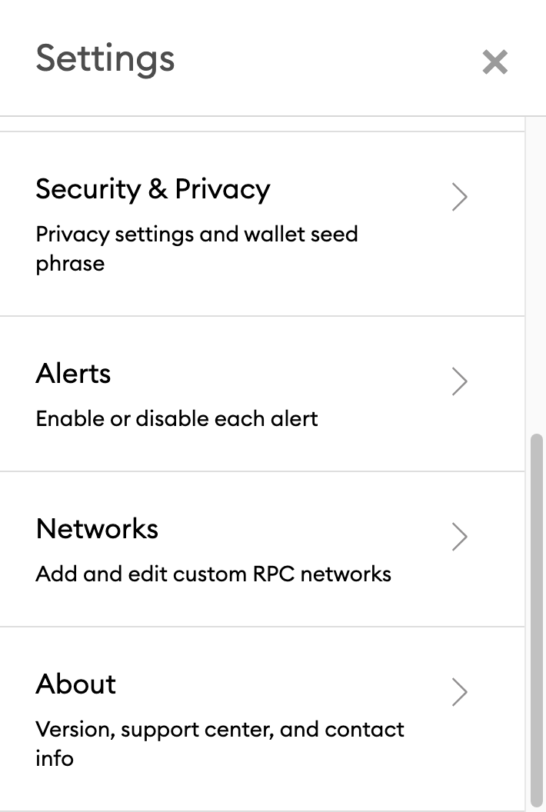

# Metamask: Add Binance Smart Chain (BSC) Network

## Connect Your MetaMask With Binance Smart Chain 

1\) Go to the settings page

2\) Click on Networks > Add Network

3\) Key in the relevant details:

* Mainnet
  * [RPC URLs](https://docs.binance.org/smart-chain/developer/rpc.html) - [https://bsc-dataseed.binance.org/](https://bsc-dataseed.binance.org)
  * ChainID: 0x38, 56 in decimal (if 56 doesn’t work, try 0x38)
  * Symbol: BNB
  * Block Explorer: https://bscscan.com

For more information on how to use MetaMask with Binance Smart Chain (BSC), you can check it out [here](https://docs.binance.org/smart-chain/wallet/metamask.html).
