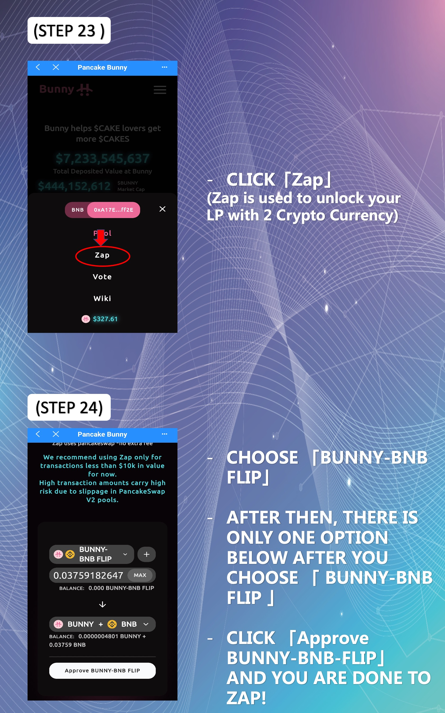
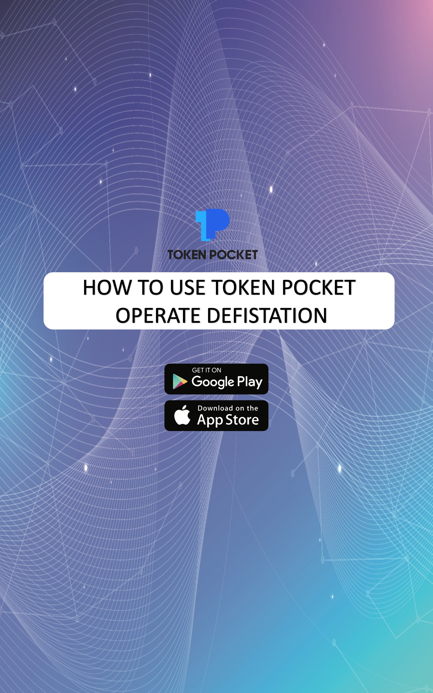

# How To Operate In Token Pocket

Let's Start To Download Token Pocket App In Your Phone\
For Android Play Store Download Link : [https://play.google.com/store/apps/details?id=vip.mytokenpocket\&hl=en\&gl=US](https://play.google.com/store/apps/details?id=vip.mytokenpocket\&hl=en\&gl=US)\
For Apple IOS App Store Download Link : [https://apps.apple.com/my/app/tokenpocket/id1436028697](https://apps.apple.com/my/app/tokenpocket/id1436028697)

### How To Use Token Pocket Operate                (Pancakeswap / Pancake Bunny) (Tutorials)

.jpeg>)

### STEP 1 & STEP 2

.jpeg>)

### STEP 3 & STEP 4

.jpeg>)

### STEP 5 & STEP 6

.jpeg>)

### STEP 7 & STEP 8

.jpeg>)

### STEP 9 & STEP 10

.jpeg>)

### STEP 11 & STEP 12

.jpeg>)

### STEP 13 & STEP 14

.jpeg>)

### STEP 15 & STEP 16

.jpeg>)

### STEP 17 & STEP 18

.jpeg>)

### STEP 19 & STEP 20

### STEP 21 & STEP 22

### STEP 23 & STEP 24

### How To Use Token Pocket Operate                            (Yield Watch) (Tutorials)

### STEP 1 & STEP 2

### STEP 3 & STEP 4

### How To Use Token Pocket Operate                            (Defibox) (Tutorials)

### STEP 1 & STEP 2

### STEP 3

### How To Use Token Pocket Operate                            (Defistation) (Tutorials)

### STEP 1 & STEP 2

### STEP 3 & STEP 4

